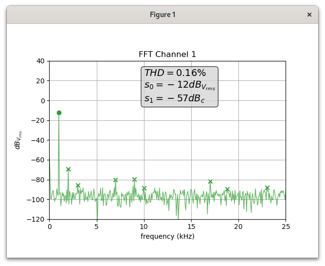

# thd.py

A program to display a live FFT from a waveform from a Siglent oscilloscope, and calculate the THD (total harmonic distortion).



## commandline options

Typing `python3 thd.py -h` will show the usage:

```
usage: thd.py [-h] -c {1,2} [-f0 FREQ] [-max_f FREQ] [-ip IP] [-port PORT] [-t NAME] [-w NAME]

Display FFT and calculate THD for a channel on Siglent SDS1202X-E oscilloscope.

options:
  -h, --help            show this help message and exit
  -c {1,2}              channel to display (default: None)
  -f0 FREQ              fundamental frequency (in Hz) (default: 1000)
  -max_f FREQ           maximum frequency to display / use for calculations (in Hz) (default: 25000)
  -ip IP                ip address of the oscilloscope (default: None)
  -port PORT            port on which the oscilloscope is listening (default: 5025)
  -t NAME, --title NAME
                        plot title (default: None)
  -w NAME, --window NAME
                        window title (default: None)
```


## how to run it

`python3 thd.py -c 1 -ip 192.168.1.227` will show the FFT from channel 1, with fundamental frequency at 1kHz (default value) and frequency span from DC to 25kHz (default value). Use the ip address from your oscilloscope (find it on your device in Utility / IO / IP Set).


## requirements and installation

The program needs the package `siglent_scpi` to talk to the oscilloscope. Install it with 

```
python3 -m pip install siglent_scpi[thd]
```

This will also install the dependencies packages "numpy", "scipy" and "matplotlib"


